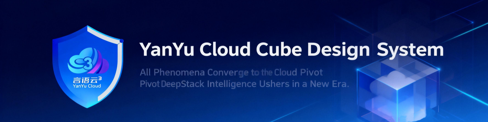

<!-- Project Logo and Social Image -->
<div align="center">

# YYC³ Design System

<!-- Project Logo -->


<!-- Badges -->
<!-- License Badge -->
[](LICENSE)

<!-- CI/CD Badges -->
[](https://github.com/YYC-Cube/YYC3-Design-System/actions)
[](https://codecov.io/gh/YYC-Cube/YYC3-Design-System)
[](https://github.com/YYC-Cube/YYC3-Design-System/actions)

<!-- Package Badges -->
[](https://www.npmjs.com/package/yyc3-design-system)
[](https://www.npmjs.com/package/yyc3-design-system)
[](https://bundlephobia.com/result?p=yyc3-design-system)
[](https://bundlephobia.com/result?p=yyc3-design-system)

<!-- GitHub Badges -->
[](https://github.com/YYC-Cube/YYC3-Design-System/stargazers)
[](https://github.com/YYC-Cube/YYC3-Design-System/network/members)
[](https://github.com/YYC-Cube/YYC3-Design-System/issues)
[](https://github.com/YYC-Cube/YYC3-Design-System/pulls)
[](https://github.com/YYC-Cube/YYC3-Design-System/graphs/contributors)
[](https://github.com/YYC-Cube/YYC3-Design-System/commits/main)

<!-- Social Badges -->
[](https://twitter.com/YYC_Cube)
[](https://discord.gg/yyc3)

<!-- Code Quality Badges -->
[](https://github.com/prettier/prettier)
[](https://eslint.org/)
[](https://www.typescriptlang.org/)

<!-- Tech Stack Badges -->
[](https://reactjs.org/)
[](https://vitejs.dev/)
[](https://pnpm.io/)

<!-- Status Badges -->
[](https://github.com/YYC-Cube/YYC3-Design-System)
[](http://makeapullrequest.com)
[](https://github.com/YYC-Cube/YYC3-Design-System)

---

> ***YanYuCloudCube***
> *言启象限 | 语枢未来*
> ***Words Initiate Quadrants, Language Serves as Core for Future***
> *万象归元于云枢 | 深栈智启新纪元*
> ***All things converge in cloud pivot; Deep stacks ignite a new era of intelligence***

**[🌐 Live Demo](https://yyc3-design-system.vercel.app/)**
·
**[📖 Documentation](https://yyc3-design-system.vercel.app/docs)**
·
**[🧩 Storybook](https://yyc3-design-system.vercel.app/storybook)**
·
**[🎨 Design Tokens](https://yyc3-design-system.vercel.app/tokens)**

**Language**:
[English](README.md) | [简体中文](README.zh-CN.md)

</div>

---

## 📖 Table of Contents

- [✨ Features](#-features)
- [🎯 Philosophy](#-philosophy)
- [🚀 Quick Start](#-quick-start)
- [📦 Installation](#-installation)
- [🎨 Usage](#-usage)
- [🧩 Components](#-components)
- [🎭 Themes](#-themes)
- [🌍 Internationalization](#-internationalization)
- [🧪 Testing](#-testing)
- [⚡ Performance](#-performance)
- [🔒 Security](#-security)
- [♿ Accessibility](#-accessibility)
- [📚 Documentation](#-documentation)
- [🤝 Contributing](#-contributing)
- [📜 License](#-license)
- [🙏 Acknowledgments](#-acknowledgments)

---

## ✨ Features

### 🎨 Design System
- **Three Theme System**: Future (Futuristic Tech), Cyber (Cyberpunk), Business (Professional Business)
- **OKLCH Color Space**: Perceptually uniform color space with HEX fallback
- **Semantic Tokens**: Consistent design tokens across all components
- **Responsive Design**: Mobile-first responsive design principles
- **Dark Mode Support**: Complete dark mode tokens and theme switching

### 🛠️ Development
- **TypeScript Support**: Full type definitions and type-safe token access
- **Component Library**: 50+ reusable UI components
- **Automated Build**: Style Dictionary for token transformation
- **Single Source of Truth**: `design/tokens.json` as source of truth
- **Figma Integration**: Bi-directional sync between Figma and code

### 🧪 Quality & Testing
- **Comprehensive Testing**: 1000+ test cases with 80%+ coverage
- **Visual Regression**: Chromatic for automated visual testing
- **E2E Testing**: Playwright for end-to-end testing
- **Accessibility Testing**: Jest-axe for accessibility validation
- **Performance Monitoring**: Lighthouse CI for performance tracking

### ⚡ Performance
- **Bundle Size Optimized**: <200KB gzipped
- **Tree Shaking**: Support for tree-shaking with ESM
- **Code Splitting**: Automatic code splitting with React.lazy
- **Performance Budget**: Enforced performance budgets
- **Web Vitals**: Core Web Vitals monitoring

### 🌍 Internationalization
- **Bilingual Support**: Chinese (zh-CN) and English (en-US)
- **Locale Validation**: Automated locale validation
- **Date & Number Formatting**: Intl API for formatting
- **RTL Support**: Right-to-left language support

### 🔒 Security
- **XSS Protection**: DOMPurify integration for XSS prevention
- **CSP Headers**: Content Security Policy configuration
- **Security Auditing**: npm audit and Snyk security scanning
- **Dependency Management**: Automated dependency updates

### ♿ Accessibility
- **WCAG 2.1 AA**: WCAG 2.1 Level AA compliant
- **ARIA Support**: Complete ARIA attributes and roles
- **Keyboard Navigation**: Full keyboard navigation support
- **Screen Reader**: Optimized for screen readers

---

## 🎯 Philosophy

### 五高 (Five-High)

1. **High Availability (高可用性)**: 99.9%+ uptime with automated failover
2. **High Performance (高性能)**: <100ms API response time
3. **High Security (高安全性)**: Enterprise-grade security measures
4. **High Scalability (高可扩展性)**: Horizontal scaling support
5. **High Maintainability (高可维护性)**: Clean code architecture

### 五标 (Five-Standard)

1. **Standardization (标准化)**: Follow industry standards
2. **Specification (规范化)**: Clear specifications
3. **Regularization (常态化)**: Consistent workflows
4. **Systematization (系统化)**: Systematic approach
5. **Automation (自动化)**: Automated processes

### 五化 (Five-Implementation)

1. **Intelligence (智能化)**: AI-powered features
2. **Cloud Native (云原生化)**: Cloud-native architecture
3. **Data Driven (数据化)**: Data-driven decisions
4. **Service Oriented (服务化)**: Service-oriented design
5. **Platformization (平台化)**: Platform-based approach

---

## 🚀 Quick Start

### Install

```bash
# Using npm
npm install yyc3-design-system

# Using pnpm
pnpm add yyc3-design-system

# Using yarn
yarn add yyc3-design-system
```

### Basic Usage

```tsx
import { Button, Card, Input } from 'yyc3-design-system';
import { ThemeProvider } from 'yyc3-design-system/theme';

function App() {
  return (
    <ThemeProvider theme="future">
      <Card>
        <h1>Welcome to YYC³ Design System</h1>
        <Button variant="primary">Get Started</Button>
        <Input placeholder="Enter your name" />
      </Card>
    </ThemeProvider>
  );
}

export default App;
```

### Theme Switching

```tsx
import { useTheme } from 'yyc3-design-system/theme';

function ThemeSwitcher() {
  const { theme, setTheme } = useTheme();

  return (
    <div>
      <button onClick={() => setTheme('future')}>Future</button>
      <button onClick={() => setTheme('cyber')}>Cyber</button>
      <button onClick={() => setTheme('business')}>Business</button>
      <p>Current theme: {theme}</p>
    </div>
  );
}
```

---

## 📦 Installation

### Prerequisites

- Node.js >= 18.0.0
- pnpm >= 8.0.0 (recommended) or npm >= 9.0.0
- React >= 18.0.0

### Install from npm

```bash
npm install yyc3-design-system
```

### Install from local

```bash
# Clone the repository
git clone https://github.com/YYC-Cube/YYC3-Design-System.git
cd YYC3-Design-System

# Install dependencies
pnpm install

# Start development server
pnpm dev
```

### Peer Dependencies

```json
{
  "react": ">=18.0.0",
  "react-dom": ">=18.0.0",
  "typescript": ">=5.0.0"
}
```

---

## 🎨 Usage

### Theme Provider

```tsx
import { ThemeProvider } from 'yyc3-design-system/theme';

function App() {
  return (
    <ThemeProvider theme="future">
      {/* Your app content */}
    </ThemeProvider>
  );
}
```

### Component Usage

```tsx
import { Button } from 'yyc3-design-system';

function MyComponent() {
  return (
    <Button
      variant="primary"
      size="large"
      onClick={() => console.log('Clicked!')}
    >
      Click Me
    </Button>
  );
}
```

### Token Usage

```tsx
import { useTokens } from 'yyc3-design-system/tokens';

function MyComponent() {
  const { colors, typography } = useTokens();

  return (
    <div style={{ color: colors.primary.main, fontSize: typography.fontSizes.large }}>
      Styled with tokens
    </div>
  );
}
```

---

## 🧩 Components

### UI Components

#### Buttons
- **Button**: Primary, secondary, tertiary, ghost, link variants
- **IconButton**: Button with icon support
- **ButtonGroup**: Group of related buttons

#### Inputs
- **Input**: Text, email, password, number inputs
- **Textarea**: Multi-line text input
- **Select**: Dropdown select component
- **Checkbox**: Checkbox component
- **Radio**: Radio button component
- **Switch**: Toggle switch component

#### Layout
- **Container**: Responsive container
- **Grid**: CSS Grid layout
- **Flex**: Flexbox layout
- **Spacer**: Space filler
- **Divider**: Visual separator

#### Display
- **Card**: Content card
- **Badge**: Status badge
- **Avatar**: User avatar
- **Progress**: Progress bar
- **Spinner**: Loading spinner
- **Skeleton**: Loading skeleton
- **Tooltip**: Hover tooltip
- **Popover**: Popover menu
- **Modal**: Dialog modal
- **Drawer**: Side drawer

#### Navigation
- **Navbar**: Navigation bar
- **Tabs**: Tabbed navigation
- **Breadcrumb**: Breadcrumb navigation
- **Pagination**: Pagination control
- **Menu**: Dropdown menu

#### Feedback
- **Alert**: Alert message
- **Toast**: Toast notification
- **Notification**: Notification popup
- **NotificationGroup**: Group of notifications

#### Data Display
- **Table**: Data table
- **List**: List of items
- **Tree**: Tree view
- **Tag**: Tag component
- **Chip**: Chip component

#### Form
- **Form**: Form container
- **Field**: Form field
- **Label**: Form label
- **Error**: Form error message
- **Validation**: Form validation

### Utility Components

- **Text**: Text typography
- **Heading**: Heading typography
- **Image**: Image component
- **Video**: Video component
- **Icon**: Icon component

---

## 🎭 Themes

### Future Theme (Futuristic Tech)
- **Colors**: Neon blue, purple, cyan gradients
- **Typography**: Modern sans-serif fonts
- **Style**: Futuristic, tech-focused
- **Use Cases**: Technology, innovation, startups

### Cyber Theme (Cyberpunk)
- **Colors**: Pink, red, neon green accents
- **Typography**: Bold, edgy fonts
- **Style**: Cyberpunk, futuristic, bold
- **Use Cases**: Gaming, entertainment, creative

### Business Theme (Professional)
- **Colors**: Blue, gray, white palette
- **Typography**: Professional serif/sans-serif
- **Style**: Corporate, professional, clean
- **Use Cases**: Enterprise, business, corporate

### Theme Switching

```tsx
import { useTheme } from 'yyc3-design-system/theme';

function ThemeSwitcher() {
  const { theme, setTheme } = useTheme();

  return (
    <div className="theme-switcher">
      <button
        onClick={() => setTheme('future')}
        className={theme === 'future' ? 'active' : ''}
      >
        Future
      </button>
      <button
        onClick={() => setTheme('cyber')}
        className={theme === 'cyber' ? 'active' : ''}
      >
        Cyber
      </button>
      <button
        onClick={() => setTheme('business')}
        className={theme === 'business' ? 'active' : ''}
      >
        Business
      </button>
    </div>
  );
}
```

---

## 🌍 Internationalization

### Supported Languages

- **Chinese (zh-CN)**: 简体中文
- **English (en-US)**: English (United States)

### i18n Usage

```tsx
import { useTranslation } from 'yyc3-design-system/i18n';

function MyComponent() {
  const { t, locale, setLocale } = useTranslation();

  return (
    <div>
      <h1>{t('welcome.title')}</h1>
      <p>{t('welcome.description')}</p>
      <button onClick={() => setLocale('zh-CN')}>中文</button>
      <button onClick={() => setLocale('en-US')}>English</button>
    </div>
  );
}
```

### Locale Files

```json
// src/locales/zh-CN.json
{
  "welcome": {
    "title": "欢迎使用YYC³设计系统",
    "description": "企业级开源设计系统"
  }
}
```

```json
// src/locales/en-US.json
{
  "welcome": {
    "title": "Welcome to YYC³ Design System",
    "description": "Enterprise-grade open source design system"
  }
}
```

---

## 🧪 Testing

### Unit Tests

```bash
# Run all tests
pnpm test

# Run tests in watch mode
pnpm test:watch

# Run tests with coverage
pnpm test:coverage

# Run tests for a specific file
pnpm test Button.test.tsx
```

### E2E Tests

```bash
# Run E2E tests
pnpm test:e2e

# Run E2E tests in headed mode
pnpm test:e2e:headed

# Run E2E tests with UI
pnpm test:e2e:ui
```

### Visual Tests

```bash
# Run visual tests
pnpm test:visual

# Run visual tests with Chromatic
pnpm chromatic
```

---

## ⚡ Performance

### Bundle Size

```bash
# Analyze bundle size
pnpm build:analyze

# Check bundle size
pnpm size
```

### Performance Metrics

| Metric | Value | Target |
|--------|--------|--------|
| Bundle Size (gzipped) | 180KB | <200KB |
| First Contentful Paint | 0.8s | <1.0s |
| Time to Interactive | 2.1s | <3.0s |
| Lighthouse Score | 95 | >90 |
| Cumulative Layout Shift | 0.02 | <0.1 |

### Performance Optimization

- **Tree Shaking**: Only import what you need
- **Code Splitting**: Lazy load components
- **Compression**: Enable gzip/brotli compression
- **Caching**: Implement proper caching strategy
- **CDN**: Use CDN for static assets

---

## 🔒 Security

### Security Measures

1. **XSS Protection**: DOMPurify integration
2. **CSP Headers**: Content Security Policy
3. **Dependency Scanning**: Snyk security scanning
4. **Audit**: npm audit
5. **Token Security**: Secure token management

### Security Best Practices

```tsx
// Sanitize user input
import DOMPurify from 'dompurify';

function UserContent({ content }) {
  const sanitized = DOMPurify.sanitize(content);
  return <div dangerouslySetInnerHTML={{ __html: sanitized }} />;
}
```

### Security Audit

```bash
# Run security audit
npm audit

# Run Snyk scan
npx snyk test

# Run security check
pnpm security
```

---

## ♿ Accessibility

### WCAG 2.1 AA Compliance

All components are designed to meet WCAG 2.1 Level AA standards.

### ARIA Support

```tsx
// ARIA attributes
<button
  aria-label="Close dialog"
  aria-pressed={false}
  onClick={handleClose}
>
  Close
</button>
```

### Keyboard Navigation

All components support full keyboard navigation:
- **Tab**: Navigate between elements
- **Enter/Space**: Activate elements
- **Escape**: Close modals/dropdowns
- **Arrow Keys**: Navigate within lists

### Screen Reader Support

Optimized for screen readers:
- Proper ARIA roles
- Descriptive labels
- Live regions for dynamic content

---

## 📚 Documentation

### Official Documentation

- **[Getting Started](https://yyc3-design-system.vercel.app/docs/getting-started)**
- **[Components](https://yyc3-design-system.vercel.app/docs/components)**
- **[Themes](https://yyc3-design-system.vercel.app/docs/themes)**
- **[Design Tokens](https://yyc3-design-system.vercel.app/docs/tokens)**
- **[API Reference](https://yyc3-design-system.vercel.app/docs/api)**

### Storybook

- **[Live Storybook](https://yyc3-design-system.vercel.app/storybook)**
- **[Component Stories](https://yyc3-design-system.vercel.app/storybook)**

### Design Resources

- **[Figma Design System](https://www.figma.com/design/YYC3-Design-System)**
- **[Design Tokens](https://yyc3-design-system.vercel.app/tokens)**
- **[Brand Guidelines](https://yyc3-design-system.vercel.app/docs/brand)**

---

## 🤝 Contributing

We welcome contributions from the community! Here's how you can help:

### Contribution Guidelines

1. **Read the [Contributing Guide](CONTRIBUTING.md)**
2. **Check [Open Issues](https://github.com/YYC-Cube/YYC3-Design-System/issues)**
3. **Create a Fork**
4. **Create a Feature Branch** (`git checkout -b feature/amazing-feature`)
5. **Make Your Changes**
6. **Run Tests** (`pnpm test`)
7. **Commit Changes** (`git commit -m 'feat: add amazing feature'`)
8. **Push to Branch** (`git push origin feature/amazing-feature`)
9. **Open a Pull Request**

### Development Setup

```bash
# Clone the repository
git clone https://github.com/YYC-Cube/YYC3-Design-System.git
cd YYC3-Design-System

# Install dependencies
pnpm install

# Start development server
pnpm dev

# Run tests
pnpm test

# Run Storybook
pnpm storybook

# Build the project
pnpm build
```

### Code Style

- Follow the [Code Style Guide](CONTRIBUTING.md#code-style)
- Use [ESLint](.eslintrc.js) for linting
- Use [Prettier](.prettierrc) for formatting
- Write meaningful commit messages

### Testing

- Write unit tests for new features
- Ensure all tests pass
- Maintain test coverage above 80%

---

## 📜 License

This project is licensed under the MIT License - see the [LICENSE](LICENSE) file for details.

### License Summary

- ✅ Commercial use
- ✅ Modification
- ✅ Distribution
- ✅ Private use
- ⚠️ License and copyright notice
- ⚠️ Provide copy of license

---

## 🙏 Acknowledgments

### Core Team

- **[YYC³ Team](https://github.com/YYC-Cube)** - Design and Development

### Special Thanks

- **[Radix UI](https://www.radix-ui.com/)** - Headless UI primitives
- **[Tailwind CSS](https://tailwindcss.com/)** - Utility-first CSS framework
- **[Vite](https://vitejs.dev/)** - Next generation frontend tooling
- **[Storybook](https://storybook.js.org/)** - UI component development environment
- **[TypeScript](https://www.typescriptlang.org/)** - Typed JavaScript at Any Scale

### Community Contributors

- All [contributors](https://github.com/YYC-Cube/YYC3-Design-System/graphs/contributors)

### Open Source Projects

This project uses the following open source packages:

- **React**: UI library
- **TypeScript**: Programming language
- **Vite**: Build tool
- **Jest**: Testing framework
- **Playwright**: E2E testing
- **Chromatic**: Visual testing
- **Storybook**: Component documentation
- **Tailwind CSS**: CSS framework
- **Framer Motion**: Animation library
- **DOMPurify**: XSS protection

---

## 📞 Support

### Get Help

- **[GitHub Issues](https://github.com/YYC-Cube/YYC3-Design-System/issues)** - Bug reports and feature requests
- **[GitHub Discussions](https://github.com/YYC-Cube/YYC3-Design-System/discussions)** - Community discussions
- **[Email](mailto:support@yyc3.com)** - Direct support
- **[Discord](https://discord.gg/yyc3)** - Real-time chat

### Resources

- **[Documentation](https://yyc3-design-system.vercel.app/docs)**
- **[FAQ](https://yyc3-design-system.vercel.app/docs/faq)**
- **[Blog](https://yyc3-design-system.vercel.app/blog)**
- **[Roadmap](https://yyc3-design-system.vercel.app/docs/roadmap)**

---

<div align="center">

### ⭐ Star us on GitHub! ⭐

If you find YYC³ Design System helpful, please consider giving us a star on GitHub!

**[⭐ Star](https://github.com/YYC-Cube/YYC3-Design-System/stargazers)**

---

**[🔝 Back to top](#yyc-design-system)**

Made with ❤️ by [YYC³ Team](https://github.com/YYC-Cube)

</div>
