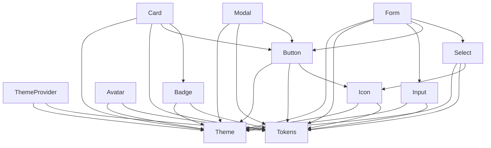

/**
 * @file 组件依赖管理规范
 * @description YYC³ 设计系统组件依赖管理规范，确保组件间依赖清晰、可维护
 * @module docs/component-dependency
 * @author YYC³
 * @version 1.0.0
 * @created 2026-02-18
 * @updated 2026-02-18
 * @copyright Copyright (c) 2026 YYC³
 * @license MIT
 */

# YYC³ 设计系统组件依赖管理规范

> ***YanYuCloudCube***
> *言启象限 | 语枢未来*
> ***Words Initiate Quadrants, Language Serves as Core for the Future***
> *万象归元于云枢 | 深栈智启新纪元*
> ***All things converge in the cloud pivot; Deep stacks ignite a new era of intelligence***

---

**创建日期**：2026-02-18
**作者**：YYC³ Team
**版本**：1.0.0
**更新日期**：2026-02-18

---

## 概述

本规范基于 YYC³ 团队「五高五标五化」核心要求，为设计系统组件提供统一的依赖管理标准，确保组件间依赖清晰、可维护、可扩展。

## 核心原则

### 依赖层次结构

```
┌─────────────────────────────────────────┐
│         应用层 (Application)           │
│  (业务组件，直接使用设计系统组件)      │
└─────────────────────────────────────────┘
                    ↓
┌─────────────────────────────────────────┐
│       复合组件层 (Composite)           │
│  (Modal, Form, Table, Card等)         │
└─────────────────────────────────────────┘
                    ↓
┌─────────────────────────────────────────┐
│       基础组件层 (Base)               │
│  (Button, Input, Select等)             │
└─────────────────────────────────────────┘
                    ↓
┌─────────────────────────────────────────┐
│       原子组件层 (Atomic)             │
│  (Icon, Avatar, Badge等)              │
└─────────────────────────────────────────┘
                    ↓
┌─────────────────────────────────────────┐
│       核心层 (Core)                   │
│  (Theme, Tokens, Hooks, Utils)         │
└─────────────────────────────────────────┘
```

### 依赖规则

#### 1. 单向依赖原则
- 上层可以依赖下层
- 下层不能依赖上层
- 同层组件可以相互依赖，但需谨慎

#### 2. 最小依赖原则
- 组件应该只依赖必要的模块
- 避免循环依赖
- 避免过度耦合

#### 3. 接口优先原则
- 依赖抽象接口而非具体实现
- 使用 TypeScript 接口定义依赖
- 便于测试和替换

## 组件分类

### 核心层组件

#### 主题系统
```typescript
// src/theme/ThemeProvider.tsx
/**
 * 主题提供者 - 核心层组件
 * 不依赖任何其他组件
 * 被所有其他组件依赖
 */
export const ThemeProvider: React.FC<ThemeProviderProps> = ({ children }) => {
  // 实现
};
```

#### 令牌系统
```typescript
// src/tokens/index.ts
/**
 * 设计令牌 - 核心层模块
 * 不依赖任何其他模块
 * 被所有其他模块依赖
 */
export const tokens = {
  color: { /* ... */ },
  spacing: { /* ... */ },
  typography: { /* ... */ }
};
```

#### Hooks
```typescript
// src/hooks/useTheme.ts
/**
 * 主题 Hook - 核心层工具
 * 不依赖任何组件
 * 被组件层使用
 */
export function useTheme(): Theme {
  // 实现
}
```

### 原子层组件

#### Icon
```typescript
// src/components/Icon.tsx
/**
 * 图标组件 - 原子层组件
 * 依赖：核心层（Theme, Tokens）
 * 被依赖：所有层
 */
import { useTheme } from '@/hooks/useTheme';

export const Icon: React.FC<IconProps> = ({ name, size }) => {
  const theme = useTheme();
  // 实现
};
```

#### Avatar
```typescript
// src/components/Avatar.tsx
/**
 * 头像组件 - 原子层组件
 * 依赖：核心层（Theme, Tokens）
 * 被依赖：基础层、复合层
 */
import { useTheme } from '@/hooks/useTheme';

export const Avatar: React.FC<AvatarProps> = ({ src, alt, size }) => {
  const theme = useTheme();
  // 实现
};
```

#### Badge
```typescript
// src/components/Badge.tsx
/**
 * 徽章组件 - 原子层组件
 * 依赖：核心层（Theme, Tokens）
 * 被依赖：基础层、复合层
 */
import { useTheme } from '@/hooks/useTheme';

export const Badge: React.FC<BadgeProps> = ({ children, variant }) => {
  const theme = useTheme();
  // 实现
};
```

### 基础层组件

#### Button
```typescript
// src/components/Button.tsx
/**
 * 按钮组件 - 基础层组件
 * 依赖：核心层（Theme, Tokens, Hooks）
 *       原子层（Icon）
 * 被依赖：复合层、应用层
 */
import { useTheme } from '@/hooks/useTheme';
import { Icon } from './Icon';

export const Button: React.FC<ButtonProps> = ({ 
  children, 
  icon, 
  variant 
}) => {
  const theme = useTheme();
  // 实现
};
```

#### Input
```typescript
// src/components/Input.tsx
/**
 * 输入框组件 - 基础层组件
 * 依赖：核心层（Theme, Tokens, Hooks）
 * 被依赖：复合层、应用层
 */
import { useTheme } from '@/hooks/useTheme';

export const Input: React.FC<InputProps> = ({ 
  placeholder, 
  value, 
  onChange 
}) => {
  const theme = useTheme();
  // 实现
};
```

#### Select
```typescript
// src/components/Select.tsx
/**
 * 选择器组件 - 基础层组件
 * 依赖：核心层（Theme, Tokens, Hooks）
 *       原子层（Icon）
 * 被依赖：复合层、应用层
 */
import { useTheme } from '@/hooks/useTheme';
import { Icon } from './Icon';

export const Select: React.FC<SelectProps> = ({ 
  options, 
  value, 
  onChange 
}) => {
  const theme = useTheme();
  // 实现
};
```

### 复合层组件

#### Card
```typescript
// src/components/Card.tsx
/**
 * 卡片组件 - 复合层组件
 * 依赖：核心层（Theme, Tokens, Hooks）
 *       基础层（Button, Badge）
 * 被依赖：应用层
 */
import { useTheme } from '@/hooks/useTheme';
import { Button } from './Button';
import { Badge } from './Badge';

export const Card: React.FC<CardProps> = ({ 
  title, 
  actions, 
  badge 
}) => {
  const theme = useTheme();
  // 实现
};
```

#### Modal
```typescript
// src/components/Modal.tsx
/**
 * 模态框组件 - 复合层组件
 * 依赖：核心层（Theme, Tokens, Hooks）
 *       基础层（Button）
 * 被依赖：应用层
 */
import { useTheme } from '@/hooks/useTheme';
import { Button } from './Button';

export const Modal: React.FC<ModalProps> = ({ 
  isOpen, 
  onClose, 
  children 
}) => {
  const theme = useTheme();
  // 实现
};
```

#### Form
```typescript
// src/components/Form.tsx
/**
 * 表单组件 - 复合层组件
 * 依赖：核心层（Theme, Tokens, Hooks）
 *       基础层（Input, Button, Select）
 * 被依赖：应用层
 */
import { useTheme } from '@/hooks/useTheme';
import { Input } from './Input';
import { Button } from './Button';
import { Select } from './Select';

export const Form: React.FC<FormProps> = ({ 
  fields, 
  onSubmit 
}) => {
  const theme = useTheme();
  // 实现
};
```

## 依赖管理策略

### 1. 依赖注入

#### Props 注入
```typescript
// 通过 Props 传递依赖
interface ButtonProps {
  icon?: React.ReactNode; // 注入 Icon 组件
  theme?: Theme; // 注入主题
}

export const Button: React.FC<ButtonProps> = ({ icon, theme }) => {
  const currentTheme = theme || useTheme();
  // 实现
};
```

#### Context 注入
```typescript
// 通过 Context 提供依赖
const ComponentContext = React.createContext<{
  theme: Theme;
  tokens: DesignTokens;
}>({
  theme: defaultTheme,
  tokens: defaultTokens
});

export const ComponentProvider: React.FC<{ children: React.ReactNode }> = ({ children }) => {
  const theme = useTheme();
  const tokens = useTokens();
  
  return (
    <ComponentContext.Provider value={{ theme, tokens }}>
      {children}
    </ComponentContext.Provider>
  );
};
```

### 2. 依赖解耦

#### 接口抽象
```typescript
// 定义接口
interface IIconComponent {
  render(name: string, size: number): React.ReactNode;
}

// 实现接口
class IconComponent implements IIconComponent {
  render(name: string, size: number): React.ReactNode {
    return <Icon name={name} size={size} />;
  }
}

// 使用接口
interface ButtonProps {
  iconComponent?: IIconComponent;
}

export const Button: React.FC<ButtonProps> = ({ 
  iconComponent = new IconComponent() 
}) => {
  // 实现
};
```

#### 工厂模式
```typescript
// 组件工厂
class ComponentFactory {
  static createIcon(name: string, size: number): React.ReactNode {
    return <Icon name={name} size={size} />;
  }
  
  static createButton(props: ButtonProps): React.ReactNode {
    return <Button {...props} />;
  }
}

// 使用工厂
export const Card: React.FC<CardProps> = ({ actions }) => {
  const actionButtons = actions.map(action => 
    ComponentFactory.createButton(action)
  );
  
  return <div>{actionButtons}</div>;
};
```

### 3. 循环依赖检测

#### 依赖图分析
```typescript
// scripts/analyze-dependencies.js
const dependencyGraph = {
  'Button': ['Theme', 'Tokens', 'Icon'],
  'Card': ['Theme', 'Tokens', 'Button', 'Badge'],
  'Modal': ['Theme', 'Tokens', 'Button'],
  'Icon': ['Theme', 'Tokens'],
  'Badge': ['Theme', 'Tokens']
};

function detectCircularDependencies(graph: Record<string, string[]>): string[][] {
  const visited = new Set<string>();
  const recursionStack = new Set<string>();
  const cycles: string[][] = [];
  
  function dfs(node: string, path: string[]): void {
    visited.add(node);
    recursionStack.add(node);
    path.push(node);
    
    const dependencies = graph[node] || [];
    for (const dep of dependencies) {
      if (!visited.has(dep)) {
        dfs(dep, [...path]);
      } else if (recursionStack.has(dep)) {
        const cycleStart = path.indexOf(dep);
        cycles.push([...path.slice(cycleStart), dep]);
      }
    }
    
    recursionStack.delete(node);
  }
  
  for (const node of Object.keys(graph)) {
    if (!visited.has(node)) {
      dfs(node, []);
    }
  }
  
  return cycles;
}

const cycles = detectCircularDependencies(dependencyGraph);
if (cycles.length > 0) {
  console.error('Circular dependencies detected:', cycles);
  process.exit(1);
}
```

## 依赖文档

### 组件依赖图



### 依赖矩阵

| 组件 | Theme | Tokens | Icon | Avatar | Badge | Button | Input | Select | Card | Modal | Form |
|------|-------|--------|------|--------|-------|--------|-------|--------|------|-------|-------|
| ThemeProvider | ✓ | ✓ | ✗ | ✗ | ✗ | ✗ | ✗ | ✗ | ✗ | ✗ | ✗ |
| Icon | ✓ | ✓ | ✗ | ✗ | ✗ | ✗ | ✗ | ✗ | ✗ | ✗ | ✗ |
| Avatar | ✓ | ✓ | ✗ | ✗ | ✗ | ✗ | ✗ | ✗ | ✗ | ✗ | ✗ |
| Badge | ✓ | ✓ | ✗ | ✗ | ✗ | ✗ | ✗ | ✗ | ✗ | ✗ | ✗ |
| Button | ✓ | ✓ | ✓ | ✗ | ✗ | ✗ | ✗ | ✗ | ✗ | ✗ | ✗ |
| Input | ✓ | ✓ | ✗ | ✗ | ✗ | ✗ | ✗ | ✗ | ✗ | ✗ | ✗ |
| Select | ✓ | ✓ | ✓ | ✗ | ✗ | ✗ | ✗ | ✗ | ✗ | ✗ | ✗ |
| Card | ✓ | ✓ | ✗ | ✗ | ✓ | ✓ | ✗ | ✗ | ✗ | ✗ | ✗ |
| Modal | ✓ | ✓ | ✗ | ✗ | ✗ | ✓ | ✗ | ✗ | ✗ | ✗ | ✗ |
| Form | ✓ | ✓ | ✗ | ✗ | ✗ | ✓ | ✓ | ✓ | ✗ | ✗ | ✗ |

## 最佳实践

### 1. 明确依赖关系
- 在组件文档中明确列出所有依赖
- 使用 TypeScript 类型确保依赖正确
- 避免隐式依赖

### 2. 最小化依赖
- 只依赖必要的组件和模块
- 避免过度耦合
- 使用组合而非继承

### 3. 接口优先
- 依赖抽象接口而非具体实现
- 便于测试和替换
- 提高可维护性

### 4. 避免循环依赖
- 定期检查依赖图
- 重构组件以解耦
- 使用依赖注入

### 5. 版本管理
- 明确依赖版本
- 使用语义化版本
- 及时更新依赖

## 工具和脚本

### 依赖分析工具
```bash
# 分析组件依赖
npm run analyze:dependencies

# 检测循环依赖
npm run check:circular-dependencies

# 生成依赖图
npm run generate:dependency-graph
```

### 自动化检查
```yaml
# .github/workflows/dependency-check.yml
name: Dependency Check

on:
  pull_request:
    paths:
      - 'src/components/**'

jobs:
  check:
    runs-on: ubuntu-latest
    steps:
      - uses: actions/checkout@v3
      - name: Setup Node
        uses: actions/setup-node@v3
        with:
          node-version: '18'
      - name: Install dependencies
        run: npm ci
      - name: Check dependencies
        run: npm run check:circular-dependencies
      - name: Analyze dependencies
        run: npm run analyze:dependencies
```

## 参考资源

- [依赖倒置原则](https://en.wikipedia.org/wiki/Dependency_inversion_principle)
- [SOLID 原则](https://en.wikipedia.org/wiki/SOLID)
- [React 组件设计模式](https://reactpatterns.com/)
- [YYC³ 标准规范](https://github.com/yyc3/standards)

---

<div align="center">

> 「***YanYuCloudCube***」
> 「***<admin@0379.email>***」
> 「***Words Initiate Quadrants, Language Serves as Core for the Future***」
> 「***All things converge in the cloud pivot; Deep stacks ignite a new era of intelligence***」

*文档最后更新：2026-02-18*

</div>
